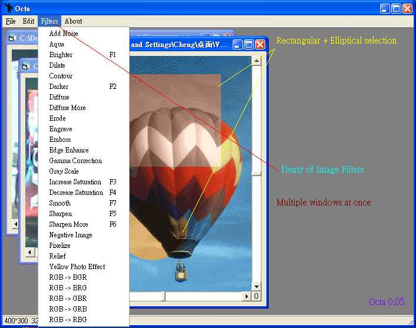



## Pic filter program

### Description

This application is a minimized photoshop filter function, great speed, and great effect.Download it!
 
### More Info
 

             |
---                |---
**Submitted On**   |2004-01-01 12:05:06
**By**             |[Alexander Cheng](https://github.com/Planet-Source-Code/PSCIndex/blob/master/ByAuthor/alexander-cheng.md)
**Level**          |Intermediate
**User Rating**    |5.0 (10 globes from 2 users)
**Compatibility**  |VB 6\.0
**Category**       |[Graphics](https://github.com/Planet-Source-Code/PSCIndex/blob/master/ByCategory/graphics__1-46.md)
**World**          |[Visual Basic](https://github.com/Planet-Source-Code/PSCIndex/blob/master/ByWorld/visual-basic.md)
**Archive File**   |[Pic\_filter168912112004\.zip](https://github.com/Planet-Source-Code/alexander-cheng-pic-filter-program__1-50715/archive/master.zip)

### API Declarations

lots, see in code

